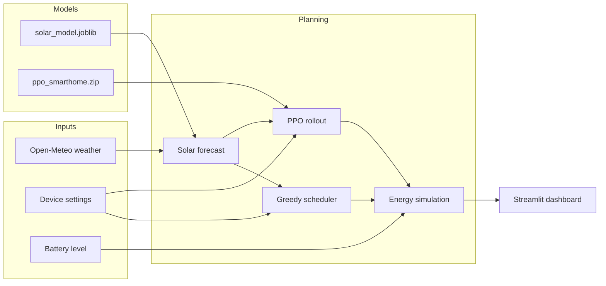

# Smart Home Energy Optimizer

A Streamlit dashboard that forecasts hourly solar generation, simulates a home battery, and schedules smart appliances to minimize grid electricity cost. Planning combines a **machine-learning solar model**, a **heuristic greedy scheduler**, and an optional **PPO reinforcement-learning agent** that picks the cheaper plan when both are available.

Grid pricing is modeled in **RON/kWh** (Romania), with locations in Romania and California for weather-aware forecasts via [Open-Meteo](https://open-meteo.com/).

---

## Features

- **Live dashboard** — location, weather, solar vs. load, battery level, and grid cost metrics
- **24-hour solar forecast** — Random Forest trained on historical data, or a Gaussian fallback if the model is missing
- **Smart device scheduling** — per-device “Smart Optimizer,” daily run hours, and hard **priority windows**
- **12 kWh home battery** — charge from solar surplus, discharge before drawing from the grid
- **Dual planners** — greedy heuristic (solar-ranked hours) vs. PPO agent; RL is used only when it does not cost more than the heuristic
- **Daily planner table** — device run blocks plus accumulator charge/discharge blocks
- **Automatic replanning** — when location, devices, weather, battery, or hour changes

---

## How it works



1. **Weather** — Hourly `cloud_cover`, `sunshine_duration`, `temperature_2m`, and `is_day` are fetched for the selected coordinates.
2. **Solar forecast** — Features are fed to the trained regressor (same column order as `trainML.py`). Missing model → bell-curve fallback.
3. **Plan context** — Manual-on devices add fixed background load; smart devices get required runtime (max of user hours and priority-window length).
4. **Schedulers** — Greedy fills remaining hours on highest-solar slots; PPO steps hour-by-hour in `SmartHomeEnv` with constraints repaired afterward.
5. **Simulation** — Hourly balance: solar → load → battery → grid; totals drive cost and the planner schedule.

---

## Project structure

| File | Role |
|------|------|
| `dashboard.py` | Streamlit UI entry point |
| `papeg.py` | Orchestration: weather, models, planning, session state |
| `utilities.py` | UI helpers: metrics, priority windows, grid reads |
| `devices.py` | `Device` model (power, optimizer, priority, runtime) |
| `accumulator.py` | 0–12 kWh battery charge/discharge |
| `gridConsumption.py` | Grid draw and RON cost (1.2 RON/kWh default) |
| `trainML.py` | Train Random Forest → `solar_model.joblib` |
| `trainRL.py` | Train PPO → `ppo_smarthome.zip` |
| `solar_data.csv` | Training data for the solar model |
| `requirements.txt` | Python dependencies |

Generated artifacts (not in repo by default):

- `solar_model.joblib` — run `python trainML.py`
- `ppo_smarthome.zip` — run `python trainRL.py` (long run; default 2.5M timesteps)

---

## Requirements

- Python 3.10+ recommended
- Internet access for Open-Meteo and (first run) package install
- Optional: GPU not required; PPO uses PyTorch via Stable-Baselines3

---

## Installation

```bash
git clone <your-repo-url>
cd Solar_Energy_Optimizer

python -m venv venv

# Windows
venv\Scripts\activate

# macOS / Linux
source venv/bin/activate

pip install -r requirements.txt
```

---

## Train models (optional but recommended)

### Solar generation model

Expects `solar_data.csv` with columns:

`hour_ts`, `cloud_cover`, `sunshine_duration`, `temperature_2m`, `is_day`, `generation_kwh`

```bash
python trainML.py
```

Writes `solar_model.joblib` and prints test MAE and R².

### Reinforcement-learning scheduler

```bash
python trainRL.py
```

Trains a PPO agent on randomized smart-home scenarios and saves `ppo_smarthome.zip`. Default training is **2,500,000** timesteps and can take a long time on CPU.

The app still runs without these files: solar uses a fallback curve; scheduling uses only the heuristic optimizer.

---

## Run the dashboard

```bash
streamlit run dashboard.py
```

Open the URL shown in the terminal (typically `http://localhost:8501`).

### Using the UI

1. **Location** — Sidebar selector (Bucharest, Cluj-Napoca, Timișoara, Iași, Constanța, California). Changing location triggers a replan.
2. **Device cards** — Toggle manual **Turn ON**, enable **Smart Optimizer**, set **Run hours/day**, or set a **Priority** window (forced ON, hard constraint).
3. **Metrics** — Current solar generation, total device load, battery state, grid cost/consumption, and full-day estimates.
4. **Planner** — Table of scheduled blocks; caption shows whether the plan came from the **RL agent** or **heuristic optimizer**.

While Smart Optimizer is on, manual ON is disabled; the planner drives on/off for the current hour.

---

## Supported devices (default catalog)

| Device | kWh/h | Default run hours/day |
|--------|-------|------------------------|
| EV Charger (Level 2) | 3.60 | 3 |
| Smart Water Heater | 2.50 | 3 |
| HVAC (Air Conditioning) | 1.50 | 6 |
| Dishwasher | 1.20 | 2 |
| Washing Machine | 1.00 | 2 |
| Main Computer | 0.50 | 8 |
| Computer Room 1 | 0.25 | 4 |
| Smart fridge | 0.15 | 24 |
| Main TV | 0.15 | 4 |
| TV Room 2 | 0.10 | 3 |

---

## Configuration

| Constant | Location | Default |
|----------|----------|---------|
| Grid price | `gridConsumption.py` | 1.2 RON/kWh |
| Battery capacity | `accumulator.py` | 0–12 kWh |
| PPO training steps | `trainRL.py` | 2,500,000 |
| Model paths | `papeg.py` | `solar_model.joblib`, `ppo_smarthome.zip` |

---

## Tech stack

- **UI:** Streamlit, Pandas
- **Solar ML:** scikit-learn Random Forest, joblib
- **RL:** Gymnasium `SmartHomeEnv`, Stable-Baselines3 PPO, PyTorch
- **Weather:** Open-Meteo REST API, `requests`

---

## Architecture notes

- **`papeg.orchestrate()`** runs on each dashboard load when replanning is needed; it updates session state used by `utilities.py`.
- **RL reward** prioritizes negative grid cost, with bonuses for self-sufficient hours and penalties for unmet required runtime.
- **Plan selection:** RL plan wins only if simulated daily grid kWh ≤ greedy plan (within floating tolerance).

---

## License

Add your license here (e.g. MIT) if you publish the repository.
