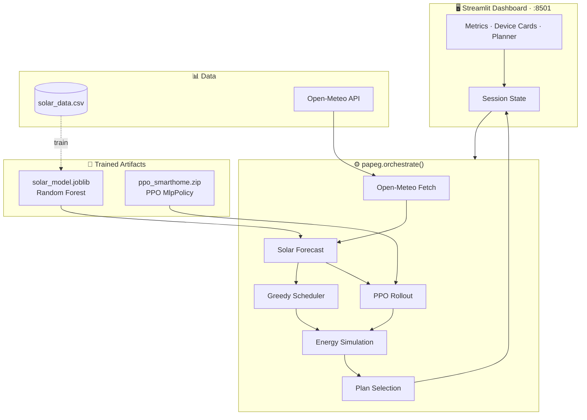
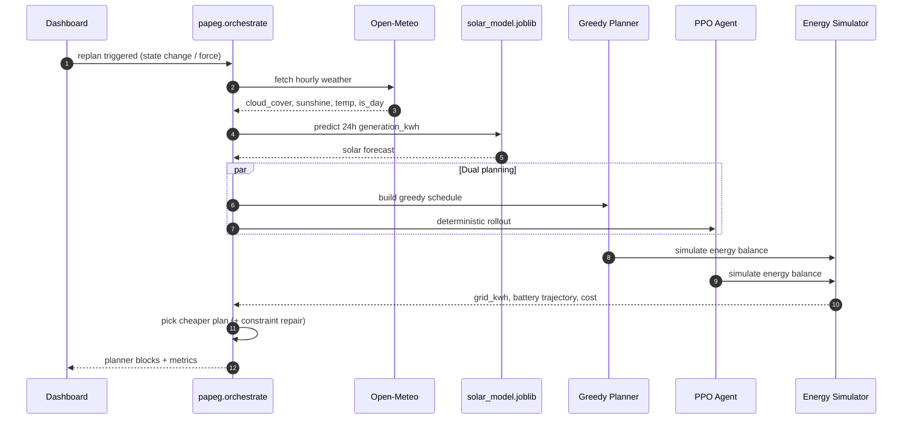

<div align="center">

# ☀️ Solar Energy Optimizer

**Weather-aware solar forecasting and PPO neural scheduling — minimize grid cost through learned load shifting.**

<br />

[](https://www.python.org/)
[](https://streamlit.io/)
[](https://pytorch.org/)
[](https://stable-baselines3.readthedocs.io/)
[](https://gymnasium.farama.org/)
[](https://scikit-learn.org/)
[](https://pandas.pydata.org/)
[](https://open-meteo.com/)

<br />


<sub><b>Dashboard</b> — live metrics, solar forecast, battery state, grid cost</sub>

<br /><br />


<sub><b>Device controls</b> — smart optimizer, priority windows, daily runtime</sub>

<br /><br />


<sub><b>Daily planner</b> — device blocks, battery charge/discharge, plan source</sub>

<br /><br />

[Quick Start](#-quick-start) ·
[Features](#-features) ·
[Architecture](#-architecture) ·
[Neural Policy](#-neural-policy-ppo--mlp) ·
[Solar ML](#-solar-forecast-model) ·
[Planning Engine](#-planning-engine) ·
[Roadmap](#-roadmap)

<br />

</div>

<br />

> A **Random Forest** regressor forecasts hourly solar generation from live weather.  
> A **PPO agent** with a PyTorch **MLP policy** schedules smart appliances hour-by-hour.  
> The planner picks whichever schedule — RL or greedy — simulates lower grid draw.

<br />

<details>
<summary><b>📑 Table of Contents</b></summary>

<br />

- [Features](#-features)
- [Quick Start](#-quick-start)
- [Architecture](#-architecture)
- [Tech Stack](#-tech-stack)
- [Project Structure](#-project-structure)
- [Solar Forecast Model](#-solar-forecast-model)
- [Neural Policy (PPO + MLP)](#-neural-policy-ppo--mlp)
- [Planning Engine](#-planning-engine)
- [Energy Accounting](#-energy-accounting)
- [Dashboard](#-dashboard)
- [Configuration](#-configuration)
- [Performance](#-performance)

</details>

<br />

---

## Features

<table>
<tr>
<td width="50%" valign="top">

### 🌤 Weather-Driven Solar Forecast
Hourly **cloud cover**, **sunshine duration**, **temperature**, and **day/night** flags from [Open-Meteo](https://open-meteo.com/) feed a trained regressor — or a Gaussian fallback if the model is absent.

### 🧠 PPO Neural Scheduler
A **Proximal Policy Optimization** agent with an **MlpPolicy** (64×64 actor + critic in PyTorch) learns to shift flexible loads into high-solar hours while respecting battery limits.

### 🔋 12 kWh Home Battery
Surplus solar charges the accumulator first; deficits discharge the battery before any grid import. Charge and discharge blocks appear in the planner table.

</td>
<td width="50%" valign="top">

### ⚖️ Dual-Planner Guardrail
Every replan runs **both** the RL rollout and a **greedy solar-ranked heuristic** through identical energy simulation. The RL plan wins only when grid kWh ≤ greedy.

### 📌 Hard User Constraints
**Priority windows** force devices ON. **Daily runtime quotas** are repaired post-rollout. Manual devices add fixed background load the agent cannot override.

### 🔄 Automatic Replanning
An MD5 state hash over devices, location, weather, battery SOC, and clock hour invalidates stale schedules — no manual refresh required.

</td>
</tr>
</table>

<br />

### Planning Modes

| Mode | Status | Description |
|:------|:------:|:------------|
| **Heuristic Optimizer** |  | Greedy solar-ranked scheduling · always available · zero model dependency |
| **RL Agent (PPO)** |  | MLP policy rollout · adopted only when cheaper than heuristic |
| **Solar ML Forecast** |  | Random Forest on `solar_data.csv` · live Open-Meteo features at inference |

<br />

---

## 🚀 Quick Start

### Prerequisites

| Tool | Version |
|:-----|:--------|
| Python | 3.10+ |
| pip | latest |
| Internet | Open-Meteo API + package install |

<br />

### 1 · Clone & Install

```bash
git clone git@github.com:marioblnn/ml-rl-solar-energy-planner.git
cd Solar_Energy_Optimizer

python -m venv venv

# Windows
venv\Scripts\activate

# macOS / Linux
source venv/bin/activate

pip install -r requirements.txt
```

<br />

### 2 · Train Models *(optional but recommended)*

**Solar regressor** — requires `solar_data.csv` with columns  
`hour_ts`, `cloud_cover`, `sunshine_duration`, `temperature_2m`, `is_day`, `generation_kwh`:

```bash
python trainML.py
```

→ writes `solar_model.joblib` · prints test **MAE** and **R²**

<br />

**PPO scheduler** — trains the MLP policy on randomized scenarios (**2.5M timesteps**, CPU-intensive):

```bash
python trainRL.py
```

→ writes `ppo_smarthome.zip`

<br />

> The dashboard runs without trained artifacts: solar uses a bell-curve fallback; scheduling uses the heuristic optimizer only.

<br />

### 3 · Run Dashboard

```bash
streamlit run dashboard.py
```

→ UI available at **`http://localhost:8501`**

<br />

### 4 · Use the UI

| Step | Action |
|:----:|:-------|
| 1 | Select a **location** in the sidebar (Bucharest, Cluj, Timișoara, Iași, Constanța, California) |
| 2 | Toggle **Smart Optimizer** on devices · set **run hours/day** or **priority windows** |
| 3 | Review live metrics — solar generation, load, battery, grid cost |
| 4 | Inspect the **Daily Planner** — caption shows **RL agent** vs **heuristic optimizer** |

<br />

---

## 🏗 Architecture



<br />

### Inference Flow



<br />

### Design Principles

| Principle | Implementation |
|:------------|:---------------|
| **Learned components earn their place** | RL plan adopted only when simulated grid kWh ≤ greedy baseline |
| **Constraints outside the network** | Priority windows and runtime quotas enforced in `SmartHomeEnv`, not learned |
| **Single energy accountant** | `_simulate()` is the source of truth for both planners and live metrics |
| **Feature contract** | `SOLAR_FEATURE_ORDER` in `papeg.py` locked to `FEATURE_COLUMNS` in `trainML.py` |
| **Graceful degradation** | Missing models → fallback solar curve + heuristic-only scheduling |

<br />

---

## 🛠 Tech Stack

<table>
<tr>
<th align="left">ML / RL</th>
<th align="left">Application</th>
</tr>
<tr>
<td valign="top">

| Layer | Technology |
|:------|:-----------|
| Neural policy | PyTorch 2.6 · Stable-Baselines3 `MlpPolicy` |
| RL algorithm | PPO · Gymnasium `SmartHomeEnv` |
| Solar regression | scikit-learn `RandomForestRegressor` |
| Serialization | joblib |
| Training data | `solar_data.csv` (~2k hourly rows) |

</td>
<td valign="top">

| Layer | Technology |
|:------|:-----------|
| UI | Streamlit 1.32 · Pandas 2.2 |
| Weather | Open-Meteo REST API · requests |
| Orchestration | `papeg.py` — forecast, planning, session state |
| Pricing | 1.2 RON/kWh grid tariff (Romania) |
| Battery | 0–12 kWh accumulator model |

</td>
</tr>
</table>

<br />

---

## 📁 Project Structure

```
Solar_Energy_Optimizer/
│
├── dashboard.py              # Streamlit UI entry point
├── papeg.py                  # Orchestration: weather → forecast → dual plan → session
├── utilities.py              # Metric helpers · priority window API
├── devices.py                # Device entity — power, optimizer, runtime, priority
├── accumulator.py            # 0–12 kWh battery charge / discharge
├── gridConsumption.py        # Grid draw · RON cost calculation
│
├── trainML.py                # Random Forest training → solar_model.joblib
├── trainRL.py                # SmartHomeEnv MDP · PPO training → ppo_smarthome.zip
├── solar_data.csv            # Labeled weather + generation training set
│
├── requirements.txt          # Pinned dependencies
└── BuildingRules.md          # Domain constraints reference
```

<br />

**Generated artifacts** *(not committed by default)*

| File | Produced by |
|:-----|:------------|
| `solar_model.joblib` | `python trainML.py` |
| `ppo_smarthome.zip` | `python trainRL.py` |

<br />

---

## 🌤 Solar Forecast Model

Supervised regression maps meteorological features to hourly **kWh generation**. Trained offline, deployed as a scikit-learn artifact reloaded on every replan.

<br />

```
┌──────────────────────────────────────────────────────────────┐
│  Train     →  solar_data.csv → RandomForest(100 trees)       │
│  Features  →  cloud_cover · sunshine · temp · is_day · hour  │
│  Target    →  generation_kwh (clipped ≥ 0)                   │
│  Eval      →  80/20 hold-out · MAE (kWh) · R²                │
│  Deploy    →  joblib → solar_model.joblib                      │
│  Inference →  Open-Meteo live features · same column order   │
│  Fallback  →  Gaussian bell curve centered at solar noon     │
└──────────────────────────────────────────────────────────────┘
```

<br />

### Feature Vector

| Feature | Source | Role |
|:--------|:-------|:-----|
| `cloud_cover` | Open-Meteo | Irradiance attenuation |
| `sunshine_duration` | Open-Meteo | Direct sunlight exposure |
| `temperature_2m` | Open-Meteo | Panel efficiency proxy |
| `is_day` | Open-Meteo | Nighttime zero-generation prior |
| `hour` | Derived from `hour_ts` | Diurnal solar curve |

<br />

### Why Random Forest Here?

| Consideration | Decision |
|:--------------|:---------|
| Data shape | Tabular · ~2k rows · heterogeneous weather |
| Train time | Seconds on CPU · no GPU dependency |
| Inference | Sub-millisecond per 24-hour batch |
| Interpretability | Feature importances for debugging |
| Normalization | Trees handle mixed scales without careful scaling |

```python
# trainML.py
RandomForestRegressor(n_estimators=100, random_state=42, n_jobs=-1)
```

<br />

---

## 🧠 Neural Policy (PPO + MLP)

The reinforcement-learning layer is the project's **neural network**. Stable-Baselines3's `MlpPolicy` implements separate **actor** (policy) and **critic** (value) heads as fully connected PyTorch modules.

<br />

### MDP: `SmartHomeEnv`

| Component | Specification |
|:----------|:--------------|
| **Horizon** | Remaining hours in day (`start_hour` → 23) |
| **Action space** | `MultiDiscrete([2] × N)` — binary ON/OFF per device |
| **Observation space** | `Box(0, 1, shape=(5 + 2N,))` |
| **Battery** | 0–12 kWh · solar → load → battery → grid dispatch order |
| **Training** | `randomize=True` — synthetic solar, device flags, priorities, SOC |

<br />


### Network Architecture

```
┌─────────────────────────────────────────────────────────────┐
│  Actor (policy)   obs(25) → Linear(64) → tanh → Linear(64)  │
│                              → tanh → 10 × Bernoulli logits │
│  Critic (value)   obs(25) → Linear(64) → tanh → Linear(64)  │
│                              → tanh → V(s)                  │
│  Algorithm        PPO clipped surrogate · 2,500,000 steps     │
│  Output           ppo_smarthome.zip                         │
└─────────────────────────────────────────────────────────────┘
```

<br />

### Reward Shaping

```
r_hour     = −(grid_kwh × 1.2 RON)  +  0.2 · 𝟙[grid_kwh = 0]
r_terminal = −20.0 × unmet_required_runtime_hours
```

| Signal | Purpose |
|:-------|:--------|
| **Grid cost** | Dominant objective — minimize imported energy |
| **Self-sufficiency bonus** | Tie-breaker for hours with zero grid draw |
| **Unmet runtime penalty** | Terminal penalty for missed daily quotas |

<br />

### Inference Guardrails

<details>
<summary><b>Post-rollout constraint repair</b></summary>

<br />

After `agent.predict(obs, deterministic=True)`:

1. Union all **priority window** hours — hard ON
2. Fill remaining **runtime deficit** on solar-ranked hours
3. Simulate through `_simulate()` alongside the greedy baseline
4. Adopt RL plan only if `grid_total ≤ greedy_grid_total`

</details>

<br />

> **Trade-off:** the MLP learns load-shifting heuristics from randomized training scenarios. Out-of-distribution live states are handled by constraint repair and the greedy fallback — the network optimizes, it does not own final authority.

<br />

---

## ⚙️ Planning Engine

### Device Catalog

| Device | kWh/h | Default run h/day |
|:-------|------:|:-----------------:|
| EV Charger (Level 2) | 3.60 | 3 |
| Smart Water Heater | 2.50 | 3 |
| HVAC (Air Conditioning) | 1.50 | 6 |
| Dishwasher | 1.20 | 2 |
| Washing Machine | 1.00 | 2 |
| Main Computer | 0.50 | 8 |
| Computer Room 1 | 0.25 | 4 |
| Smart fridge | 0.15 | 24 |
| Main TV | 0.15 | 4 |
| TV Room 2 | 0.10 | 3 |

<br />

### Greedy Baseline

```
1. Seed on-hours with priority window hours (future only)
2. Sort remaining hours by (−solar_forecast, hour_index)
3. Assign device-hours greedily — highest consumers first
4. Simulate through shared energy accountant
```

<br />

### Replanning Trigger

`needsReplan()` fires when any of these change:

| Signal | Key |
|:-------|:----|
| Device config | name · smart flag · priority · runtime · manual state |
| Clock | current hour (location timezone) |
| Environment | location · weather snapshot · battery SOC |
| Artifacts | `solar_model.joblib` / `ppo_smarthome.zip` presence |

<br />

---

## 🔋 Energy Accounting

Single source of truth in `papeg._simulate()` and `SmartHomeEnv._apply_energy_balance()`:

```
if solar ≥ load:
    charge    = min(surplus, battery_headroom)
else:
    discharge = min(deficit, battery_soc)
    grid      = deficit − discharge
```

<br />

| Dispatch order | Rationale |
|:---------------|:----------|
| Solar → load | Direct self-consumption first |
| Surplus → battery | Store before export (no feed-in tariff modeled) |
| Deficit → battery | Discharge before grid import |
| Remainder → grid | Costed at 1.2 RON/kWh |

<br />

---

## 🖥 Dashboard

Stateless view layer — reads planner output and live metrics from Streamlit session state. **No client-side scheduling logic.**

<br />

### Live Metrics

| Metric | Source |
|:-------|:-------|
| Solar generation (current hour) | ML forecast · `KEY_SOLAR_FORECAST` |
| Device load | Smart devices ON + manual background |
| Battery SOC | `Accumulator` session object |
| Grid consumption / cost | Simulated plan for current hour |
| Daily grid kWh / cost | Full-day plan totals |
| Plan source | `"RL agent"` · `"heuristic optimizer"` · `"none"` |

<br />

### Device Controls

| Control | Behavior |
|:--------|:---------|
| **Turn ON** | Manual override — disabled when Smart Optimizer is active |
| **Smart Optimizer** | Planner drives on/off for current hour |
| **Run hours/day** | Minimum daily runtime quota |
| **Priority window** | Hard constraint — device forced ON in range |

<br />

---

## ⚙️ Configuration

| Constant | File | Default |
|:---------|:-----|:--------|
| Grid tariff | `gridConsumption.py` | 1.2 RON/kWh |
| Battery capacity | `accumulator.py` | 0–12 kWh |
| PPO timesteps | `trainRL.py` | 2,500,000 |
| Solar obs scale | `trainRL.py` | 15.0 kWh |
| Self-sufficient bonus | `trainRL.py` | 0.2 |
| Unmet runtime penalty | `trainRL.py` | 20.0 / device-hour |
| Model paths | `papeg.py` | `solar_model.joblib` · `ppo_smarthome.zip` |

<br />

---

## ⚡ Performance

<table>
<tr>
<th>Area</th>
<th>Approach</th>
<th>Why</th>
</tr>
<tr>
<td>Solar inference</td>
<td>Cached <code>joblib</code> model in session</td>
<td>Replans are frequent — reload once per process</td>
</tr>
<tr>
<td>PPO inference</td>
<td>Cached <code>PPO.load()</code> + deterministic rollout</td>
<td>24 forward passes per replan · no training overhead</td>
</tr>
<tr>
<td>Dual planning</td>
<td>Greedy always runs · RL optional</td>
<td>Guaranteed baseline even if zip is missing</td>
</tr>
<tr>
<td>Replan gating</td>
<td>MD5 state hash</td>
<td>Skip redundant weather fetch + inference on unchanged state</td>
</tr>
<tr>
<td>Random Forest</td>
<td>100 trees · <code>n_jobs=-1</code></td>
<td>Full CPU parallelism at train time · fast predict</td>
</tr>
<tr>
<td>Observation norm</td>
<td>Clip to <code>[0, 1]</code></td>
<td>Stable MLP inputs across randomized training scenarios</td>
</tr>
</table>

<br />

### Scaling Path

| Today | Production |
|:------|:-----------|
| Single-process Streamlit | Containerized deploy · model artifacts in object storage |
| In-memory model cache | Warm-start sidecar · versioned model registry |
| Open-Meteo live fetch | Cached forecasts · TTL per location |
| CPU PPO training | GPU training pipeline · reduced timestep budget for CI |

<br />

---

<div align="center">

<br />

**Solar Energy Optimizer**

*Random Forest solar forecasting · PPO neural scheduling · dual-planner grid cost minimization*

<br />

☀️ ⚡ 🔋

</div>
